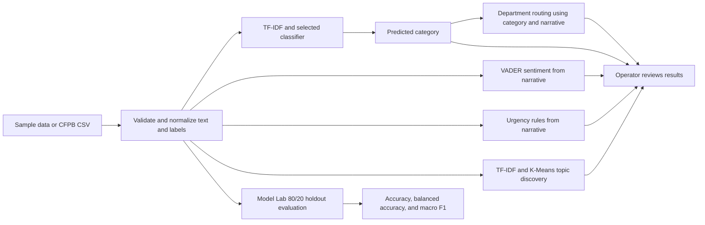

# AI-Powered Customer Support Ticket Intelligence

A local Streamlit application for exploring complaint classification, triage signals, support routing, and recurring themes. It is a decision-support prototype built with scikit-learn, VADER, and transparent keyword rules.

## Overview

The project demonstrates how consumer complaint narratives can be converted into reviewable signals for a support team. Operators can explore a small illustrative sample or upload a CFPB complaint CSV. The application does not create tickets, contact customers, or take action in another system.

## Project flow


## Features

- **Overview:** complaint volume, category distribution, urgency signals, and sentiment summary.
- **Live triage:** analyze one narrative or a CSV batch; download the results as an annotated CSV.
- **Recurring issues:** group complaint narratives into exploratory clusters and inspect their keywords and examples.
- **Model lab:** compare Logistic Regression, Linear SVM, or Naive Bayes using held-out accuracy, balanced accuracy, and F1; download the session evaluation log as CSV.
- **Data source:** use the bundled illustrative dataset or upload a CFPB CSV and select a category label.

## Quick start

### Requirements

- Python 3.11 or newer
- pip

### Windows PowerShell

```powershell
python -m venv .venv
.\.venv\Scripts\Activate.ps1
python -m pip install -r requirements.txt
python -m streamlit run app.py
```

### macOS or Linux

```bash
python3 -m venv .venv
source .venv/bin/activate
python -m pip install -r requirements.txt
python -m streamlit run app.py
```

Open the local address printed by Streamlit, normally `http://localhost:8501`. To stop the server, press `Ctrl+C` in the terminal running it.

## Deployment

The app is structured for [Streamlit Community Cloud](https://share.streamlit.io/) and other hosts that can install Python dependencies from `requirements.txt`.

### Streamlit Community Cloud

1. Push this project to a GitHub repository. Keep `app.py`, `requirements.txt`, and the supporting Python files at the repository root.
2. In Streamlit Community Cloud, create an app and select the repository and branch.
3. Set the main file path to `app.py`, select Python 3.11 or newer, and deploy.
4. After deployment completes, open the URL provided by Streamlit.

The evaluation history is kept in Streamlit session state and can be downloaded from **Model lab**. Hosted app filesystems and sessions may be restarted, so download the CSV if the history must be retained. This app has no authentication or access controls; do not deploy publicly with real or sensitive complaint data unless the hosting environment and data handling have been approved by your organization.

## Operator workflow

1. **Choose a data source.** In the sidebar, use **Sample dataset** to explore the workflow. For real complaint records, download a CSV from the [CFPB Consumer Complaint Database](https://www.consumerfinance.gov/data-research/consumer-complaints/) and select **Upload CFPB CSV**.
2. **Choose a training label.** For CFPB data, select the field the classifier should predict. `Product` usually represents a broader category; `Issue` usually represents a more specific complaint type. The narrative field must be `Consumer complaint narrative` or `narrative`.
3. **Review the overview.** In **Overview**, check total records and category mix. Review the high/urgent examples as prompts for investigation, not as a confirmed service-level breach or managed work queue.
4. **Analyze complaints.** In **Live triage**, enter one complaint and select **Analyze complaint**, or upload a batch CSV containing a narrative column. Review the returned category, urgency, sentiment, and suggested department. Use **Download analyzed CSV** to export batch results.
5. **Investigate themes.** In **Recurring issues**, select a cluster count and review each theme's keywords with its example complaint. Treat clusters as investigation leads, not verified root causes.
6. **Review before acting.** Compare every suggestion with the original complaint and your organization's routing policy. The application does not update a ticketing system or contact the customer.

The **Model lab** is an optional maintainer view for comparing the available classifiers. Most operators can use the default Logistic Regression model without changing this setting.

Selecting a classifier evaluates it on a deterministic holdout from the current training sample. Each selected model and dataset snapshot is added to the session evaluation log. Accuracy is shown with balanced accuracy and macro F1 so that overall correctness is not the only comparison, particularly when category counts differ.

## Interpreting results

| Output | How it is produced | How to use it |
| --- | --- | --- |
| Category | TF-IDF classifier trained on the selected dataset and label | Treat as a suggested label and verify against the complaint. |
| Relative model score | Model-specific score associated with the predicted label | Not a calibrated probability or guaranteed confidence estimate. |
| Holdout accuracy | Share of held-out complaints assigned the correct category | Compare only across evaluations using the same dataset and holdout procedure. |
| Balanced accuracy and macro F1 | Metrics that give each observed category more equal influence | Review with per-category results before deciding a model is fit for use. |
| Urgency | Phrase-matching rules return `Urgent`, `High`, or `Normal` | Use as a review signal. `Normal` does not mean a complaint can safely wait. |
| Sentiment | VADER sentiment lexicon and compound score | An estimate of wording, not a measure of customer impact or intent. |
| Suggested department | Keyword rules applied to the predicted category and complaint text | Confirm the team is appropriate under current routing policy. |
| Recurring theme | TF-IDF features clustered with K-Means | Inspect source examples before drawing conclusions about causes or trends. |

## Data handling

- The bundled sample contains 60 hand-curated narratives across six categories. It is illustrative and is not representative of CFPB complaints or a production training corpus.
- CFPB exports should be CSV files with complaint narrative text and a category field. The upload dialog lets the operator select the field to use as the training label. Rows without narrative text or a label are excluded.
- Headline counts use the normalized uploaded dataset. For responsiveness, up to 20,000 records are sampled for model training and up to 5,000 for overview sentiment and topic exploration.
- Batch triage accepts up to 10,000 rows per run and expects a narrative column such as `Consumer complaint narrative` or `narrative`.
- Optional recognized fields include date received and company. The required inputs are complaint narrative and the selected label.

## Model and decision logic

- **Text representation:** lowercase, accent-normalized unigram and bigram TF-IDF features.
- **Category baselines:** Logistic Regression, Linear SVM, and Multinomial Naive Bayes.
- **Sentiment:** VADER compound sentiment with positive, neutral, or negative labels.
- **Urgency and routing:** deterministic phrase/keyword rules; no learned urgency label is trained because the dataset does not provide an equivalent support-priority target.
- **Recurring issues:** K-Means clusters over TF-IDF narrative vectors. Cluster keywords are descriptive terms, not automatically assigned business categories.

No benchmark or production performance claim is made. The bundled sample is too small and curated to measure generalization. Model scores shown by the application are not calibrated probabilities.

## Project structure

```text
.
├── app.py                         # Streamlit interface and page flow
├── data.py                        # Bundled illustrative dataset
├── ticket_intelligence.py         # Normalization, models, and NLP rules
├── security_utils.py              # Safe CSV export helpers and upload limit
├── .streamlit/config.toml         # Themes, upload size, and server protections
├── requirements.txt               # Runtime dependencies
├── requirements-dev.txt           # Test dependencies
├── LICENSE                        # MIT License
├── .github/workflows/tests.yml    # Continuous integration tests
├── tests/
│   ├── test_ticket_intelligence.py
│   └── test_security_utils.py
└── README.md
```

## Tests

Install the development requirements and run the test suite from the project root:

```powershell
python -m pip install -r requirements-dev.txt
python -m pytest -q
```

The tests cover the sample payment classification and deterministic holdout metrics across all three baselines, CFPB column normalization, urgency and sentiment outputs, and topic clustering.

## Security checks

Continuous integration runs dependency vulnerability checks with `pip-audit` and static analysis with Bandit on pushes and pull requests. Run both checks locally with the development dependencies installed:

```powershell
python -m pip_audit -r requirements-dev.txt
python -m bandit -q -r app.py ticket_intelligence.py data.py security_utils.py
```

## Security and responsible use

Complaint narratives may contain personal or financial information. Uploads are limited to 25 MB, and batch processing reads at most 10,001 rows to enforce the 10,000-row analysis cap. Trained models are kept in the active Streamlit session rather than a cross-user global model cache. Downloaded batch CSV text cells that begin like spreadsheet formulas are neutralized. Streamlit CORS and XSRF protection remain enabled in `.streamlit/config.toml`.

The application still has **no authentication, role-based access, audit logging, or retention controls**. The evaluation log is session-only and contains metrics rather than complaint text. Do not deploy this app publicly with internal, confidential, or personally identifiable ticket data. Use public or approved sample data unless you first add and verify organization-approved authentication, access control, and retention policies. Uploaded data is processed by the server hosting the Streamlit app.

Keep a human reviewer in the loop. The urgency rules, sentiment estimate, classifier output, and department suggestion can be wrong or incomplete and should not be the sole basis for customer-impacting decisions.

## Before production use

- Evaluate on representative, held-out and preferably time-separated data; report per-class precision and recall, macro F1, and a confusion matrix. The Model lab metrics are an initial baseline, not production certification.
- Check for label quality, class imbalance, data leakage, and performance differences across relevant customer groups.
- Calibrate or clearly suppress confidence scores; define review thresholds with operational owners.
- Validate urgency and routing rules with support teams, and establish ownership for updates and monitoring.
- Complete privacy, security, access-control, retention, and deployment reviews before handling real customer data operationally.

## License

This project is licensed under the MIT License. See [LICENSE](LICENSE) for the full text.
